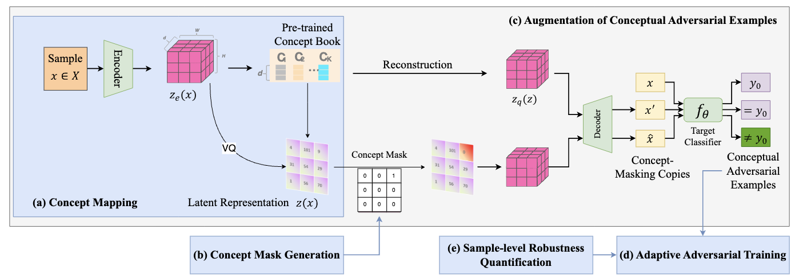
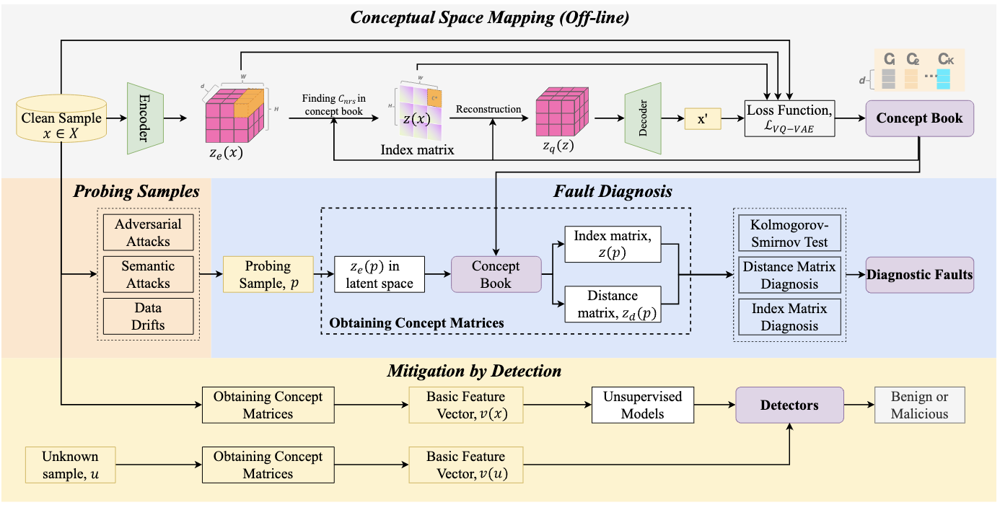
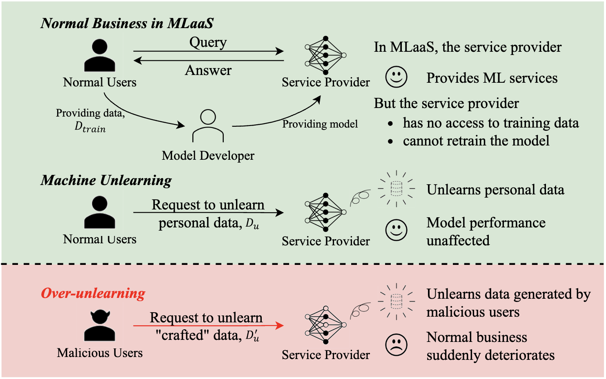
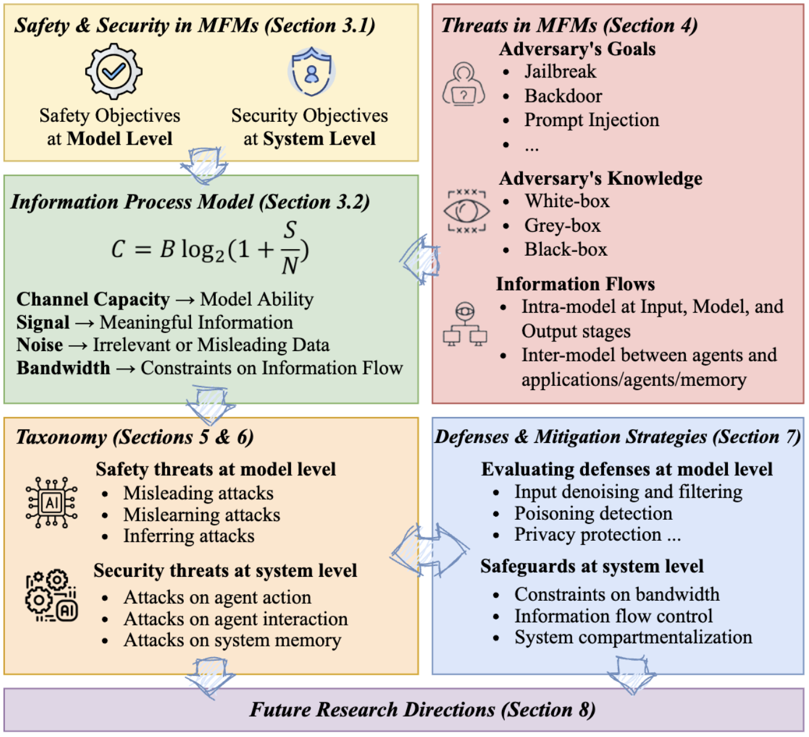
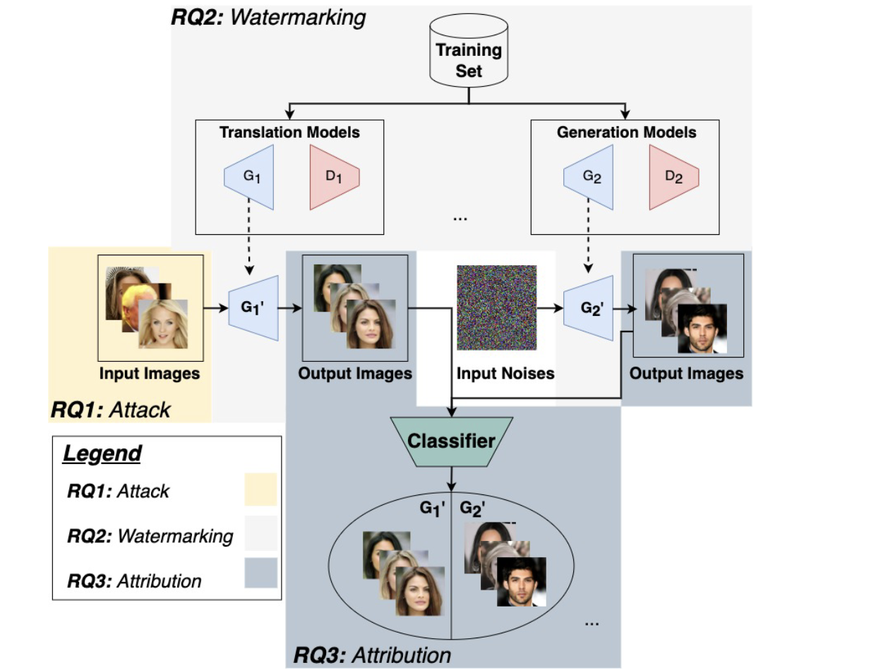








I am a PhD student at the University of New South Wales, supervised by of Dr. Hammond Pearce and Dr. Jason Xue. My research is supported by the UNSW UIPA Scholarship and CSIRO’s Data61 Top-up Scholarship, focusing on vulnerablities of AI models.

My research interest includes AI security and safety, multi-modal models and embodied robotics. I have published several papers at the top international AI and security conferences (e.g. S&P, Usenix, NDSS, WWW) with total <a href='https://scholar.google.com/citations?user=O3skY1PlJqQC'>google scholar citations <strong>80+</strong></a> (You can also use google scholar badge ).

# 📝 Publications 

S&P 2024

[LACMUS: Latent Concept Masking for General Robustness Enhancement of DNNs]

Shuo Wang, Hongsheng Hu, **Jiamin Chang**, Benjamin Zi Hao Zhao, Minhui Xue
- **S&P 2024**
[**Link**](https://scholar.google.com/citations?view_op=view_citation&hl=en&user=O3skY1PlJqQC&citation_for_view=O3skY1PlJqQC:2osOgNQ5qMEC) <strong></strong>
- We present LAtent Concept Masking for robUStness (LACMUS), a novel perceptually-driven methodology that enhances DNN robustness without requiring prior knowledge about the adversarial contexts. We argue that DNNs’ sensitivity to adversarial perturbations and distribution drifts stems from overfitting to non-common concepts within the dataset, leading to an over-reliance on specific learned instances and increased vulnerability. LACMUS addresses this by mapping high-dimensional data into a latent conceptual space to identify and navigate patterns of "non-common concepts" within the latent concept space. 

Usenix 2024

[{DNN-GP}: Diagnosing and Mitigating Model's Faults Using Latent Concepts]

Shuo Wang, Hongsheng Hu, **Jiamin Chang**, Benjamin Zi Hao Zhao, Qi Alfred Chen, Minhui Xue
- **Usenix 2024**
[**Link**](https://scholar.google.com/citations?view_op=view_citation&hl=en&user=O3skY1PlJqQC&citation_for_view=O3skY1PlJqQC:9yKSN-GCB0IC) <strong></strong>
- We present a fault diagnosis tool (akin to a General Practitioner) DNN-GP, an integrated interpreter designed to diagnose various types of model faults through the interpretation of latent concepts. DNN-GP incorporates probing samples derived from adversarial attacks, semantic attacks, and samples exhibiting drifting issues to provide a comprehensible interpretation of a model's erroneous decisions. Armed with an awareness of the faults, DNN-GP derives countermeasures from the concept space to bolster the model's resilience.

NDSS 2024

[A duty to forget, a right to be assured? exposing vulnerabilities in machine unlearning services]

Hongsheng Hu, Shuo Wang, **Jiamin Chang**, Haonan Zhong, Ruoxi Sun, Shuang Hao, Haojin Zhu, Minhui Xue
- **NDSS 2024**
[**Link**](https://scholar.google.com/citations?view_op=view_citation&hl=en&user=O3skY1PlJqQC&citation_for_view=O3skY1PlJqQC:qjMakFHDy7sC) <strong></strong>
- We try to explore the potential threats posed by unlearning services in MLaaS, specifically over-unlearning, where more information is unlearned than expected. We propose two strategies that leverage over-unlearning to measure the impact on the trade-off balancing, under black-box access settings, in which the existing machine unlearning attacks are not applicable. The effectiveness of these strategies is evaluated through extensive experiments on benchmark datasets, across various model architectures and representative unlearning approaches. 

Arxiv

[SoK: Unifying Cybersecurity and Cybersafety of Multimodal Foundation Models with an Information Theory Approach]

Ruoxi Sun, **Jiamin Chang**, Hammond Pearce, Chaowei Xiao, Bo Li, Qi Wu, Surya Nepal, Minhui Xue
- **Arxiv**
[**Link**](https://scholar.google.com/citations?view_op=view_citation&hl=en&user=O3skY1PlJqQC&citation_for_view=O3skY1PlJqQC:UeHWp8X0CEIC) <strong></strong>
- We conceptualize cybersafety and cybersecurity in the context of multimodal learning and present a comprehensive Systematization of Knowledge (SoK) to unify these concepts in MFMs, identifying key threats to these models. We propose a taxonomy framework grounded in information theory, evaluating and categorizing threats through the concepts of channel capacity, signal, noise, and bandwidth. This approach provides a novel framework that unifies model safety and system security in MFMs, offering a more comprehensive and actionable understanding of the risks involved. 

WWW 2023

[Copyright protection and accountability of generative ai: Attack, watermarking and attribution]

Haonan Zhong, **Jiamin Chang** (Co-first Author), Ziyue Yang, Tingmin Wu, Pathum Chamikara Mahawaga Arachchige, Chehara Pathmabandu, Minhui Xue
- **WWW 2023**
[**Link**](https://scholar.google.com/citations?view_op=view_citation&hl=en&user=O3skY1PlJqQC&citation_for_view=O3skY1PlJqQC:u5HHmVD_uO8C) <strong></strong>
- We propose an evaluation framework to provide a comprehensive overview of the current state of the copyright protection measures for GANs, evaluate their performance across a diverse range of GAN architectures, and identify the factors that affect their performance and future research directions. Our findings indicate that the current IPR protection methods for input images, model watermarking, and attribution networks are largely satisfactory for a wide range of GANs. 

# 🎖 Honors and Awards
- *2021.10* Lorem ipsum dolor sit amet, consectetur adipiscing elit. Vivamus ornare aliquet ipsum, ac tempus justo dapibus sit amet. 
- *2021.09* Lorem ipsum dolor sit amet, consectetur adipiscing elit. Vivamus ornare aliquet ipsum, ac tempus justo dapibus sit amet. 

# 📖 Educations
- *2019.06 - 2022.04 (now)*, Lorem ipsum dolor sit amet, consectetur adipiscing elit. Vivamus ornare aliquet ipsum, ac tempus justo dapibus sit amet. 
- *2015.09 - 2019.06*, Lorem ipsum dolor sit amet, consectetur adipiscing elit. Vivamus ornare aliquet ipsum, ac tempus justo dapibus sit amet. 

  # 🔥 News
# - *2022.02*: &nbsp;🎉🎉 Lorem ipsum dolor sit amet, consectetur adipiscing elit. Vivamus ornare aliquet ipsum, ac tempus justo dapibus sit amet. 
# - *2022.02*: &nbsp;🎉🎉 Lorem ipsum dolor sit amet, consectetur adipiscing elit. Vivamus ornare aliquet ipsum, ac tempus justo dapibus sit amet. 
